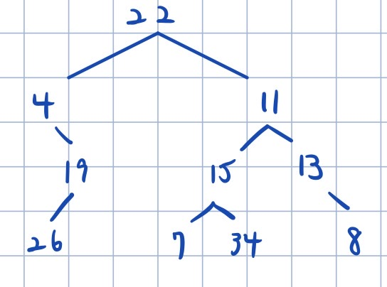
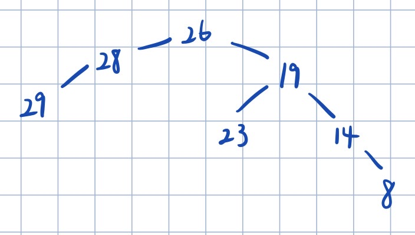
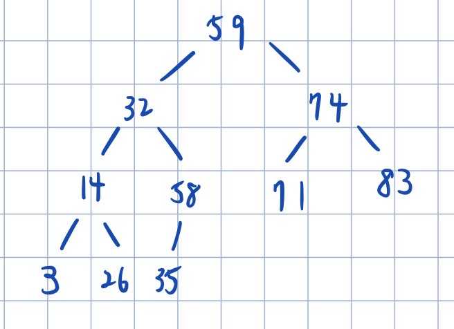
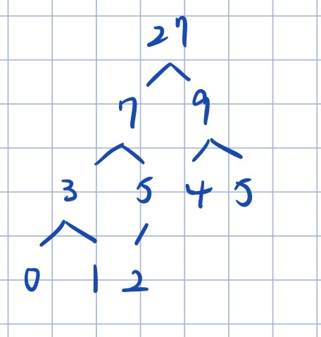
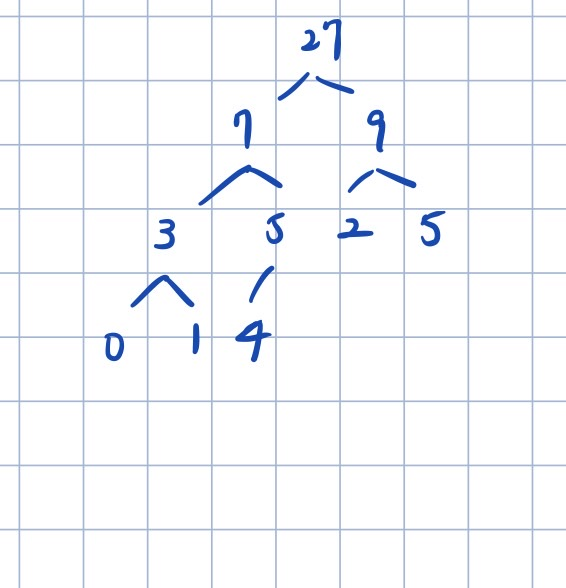

# **DSA-Hw2**

## **Problem 0 - Proper References**
- Problem 3-3~3-6:  
  https://www.techiedelight.com/construct-cartesian-tree-from-inorder-traversal/  
  https://github.com/youngyangyang04/leetcode-master/blob/master/problems/0235.二叉搜索树的最近公共祖先.md

## **Problem 1 - Lucy’s Laptop**
### 1.
  

`human algorithm`:  
找出 postorder traversal 的最後一個 node(22)，必為 binary tree 的 root node，在 inorder traversal 以 node(22) 為分界，左半邊的nodes(4, 26, 19) 構成 binary tree 的 left subtree， 右半邊的 nodes(7, 15, 34, 11, 13, 8) 構成 binary tree 的 right subtree。接著重複找出 left subtree 與 right subtree 在 postorder traversal 的最後一個 node 作為 left subtree 的 root node，以此 root node 在 inorder traversal 為分界，左半邊的 nodes 構成 left subtree，右半邊的 nodes 構成 right subtree，直到無法在 inorder traversal 分出 left subtree 與 right subtree 為止。  

<br>
<div style="page-break-after: always;"></div>

### 2.
  

<br>

### 3.
`human algorithm`:  
- 用 right leaf 開始的 inorder-traversal (順序為right->root->left) 遍歷每個node  
- 將當前所在的 node 加上當前遍歷過的所有node總和，也就是前一個 node 更新後的的新值

`pseudo code`:
```
update_Node(Node, accumulation):
    Node.val = Node.val + accumulation
    return Node.val

inorder_traversal(Node):
    accumulation = 0
    // right subtree
    if (Node->right != NIL)
        accumuation = inorder_traversal(Node->right)
    // subtree's root
    accumuation = update_Node(Node, accumuation)
    //left subtree
    if (Node->left != NIL)
        accumuation = inorder_traversal(Node->left)
    return accumuation

modify_T(T):
    inorder_traversal(T)
    return T

```

`time complexity`:

遍歷每個node的 time complexity 為 O(n)，更新一個 node 的 time complexity 為 O(1)，因此更新整棵樹的time complexity 為 O(n)。

<br>

### 4.
by definition, if x is the left leaf of y, when x->right exist, x->right.val must be smaller than y.val, and if x is the right leaf of y, when x->left exist, x->left.val must be larger than y.val. So, when x->right exist and x->left exist, y is neither the smallest node among all nodes larger than x, nor the largest node among all nodes smaller than x.

<br>
<div style="page-break-after: always;"></div>

### 5.


<br>

### 6.
`human algorithm`:  
We can calculate the total position we use with tree height is $2^{height}-1$, then, with the actual positions we use to store valid value (which is number of nodes), we can get the wasted positions is $(2^{height}-1)$ - num of Nodes.  
We can count number of nodes and tree height by level-order traveral.

`pseudo code`:
```C
cal_waste(T):
    count = 0
    depth = 0
    Q = empty queue
    Q.push(T)

    while(Q is not empty):
        size = Q.length
        depth += 1
        for (i = 1 to i = size):
            Q.pop()
            count += 1
            if (T->left exist): Q.push(T->left)
            if (T->right exist): Q.push(T->right)
    
    total_positions = 2^(depth) - 1
    wasted_positions = total_positions - count
    return wasted_positions
```

`time complexity`:  
level-order traveral will traverse every tree nodes once.
Therefore, the time complexity of level-order traveral is O(n).

<br>
<div style="page-break-after: always;"></div>

## **Problem 2 - Teaching Assistant to Music Teacher**

### 1.
對任意的3個 $a_i$, $a_j$, $a_k$ 必定可以在 $3!$ 內找到其中兩個數分別為3數中的最大與最小值是哪兩個數(但無罰得知誰是最大誰是最小)。透過這個性質，從 $a_1$, $a_2$, $a_3$ 開始尋找並存下 { $min(a_1, a_2, a_3), max(a_1, a_2, a_3)$ }，接著從 $min(a_1, a_2, a_3), max(a_1, a_2, a_3)$, $a_4$ 尋找並存下 { $min(a_1, a_2, a_3, a_4), max(a_1, a_2, a_3, a_4)$ }，以此類推，查找到 $min(a_1, a_2,... a_{n-1}), max(a_1, a_2,... a_{n-1})$, $a_n$，便可以得到 { $min(a_1, a_2,... a_n), max(a_1, a_2,... a_n)$ }，即 { $a_m,a_M$ }

`pseudo code`:
```C
get_min_Max(array a):
    for (i,j,k) in {(1,2,3),(1,3,2),(2,1,3),(2,3,1),(3,1,2),(3,2,1)}
        if query_attitude_value(i,j,k) is True
            idx1, idx2 = i, k
            break

    if n equal to 3
        return {a[idx1], a[idx2]}
    else
        for I in range (4 to n)
            for (i,j,k) in {(idx1,idx2,I),(idx1,I,idx2),(idx2,idx1,I),(idx2,I,idx1),(I,idx1,idx2),(I,idx2,idx1)}
                if query_attitude_value(i,j,k) is True
                    idx1, idx2 = i, k
                    break;
        return {a[idx1], a[idx2]}
```

`query complexity`:  
尋找一次 idx1, idx2 的 query complexity 為 O(1), 遍歷 $a_1$ 到 $a_n$ 的 query complexity 為 O(n)，因此尋找 { $a_m$, $a_M$ } 的 query complexity 為 O(n)

<br>

### 2.  
將 sub-problem algorithm 命名為 `get_min_Max`，令 { $a_m,a_M$ } = get_min_Max(a)，將 $a_m$ 與 $a_1$ 交換位置，$a_M$ 與 $a_3$ 交換位置，$a_1$ ~ $a_3$ 作為 sorted pile。若 n = 3， a 即為 sorted array。  
若 n > 3，則依序將 $a_4$ ~ $a_n$ (unsorted pile) insert 進 sorted pile 正確的位置，在 sorted pile 中正確位置 m 的條件為 query_attitude_value(a[m-1], a[m], a[m+1])必須為True。

```C
Sort(array a):
    a_m, a_M = get_min_Max(a)
    for i = 1 to n
        if a[i] = a_m
            swap(a[1], a[i])
        if a[i] = a_M
            swap(a[3], a[i])
    if n equal to 3
        return a
    else
        left = 1
        right = 3
        mid = floor((left+right)/2)
        for i in range (4 to n)
            while(mid not equal to left)
                if query_attitude_value(a[mid], a[i], a[right]) is true
                    left = mid
                else 
                    right = mid
                mid = floor((left+right)/2)
            move a[k] to a[k+1] for k in range ((mid+1) to length of sorted pile)
            length = length + 1
            a[mid+1] = a[i]
        return a
```

`query complexity`:  
get_min_Max(a) 的 query complexity 為 O(n)，insert $a_i$ from unsorted pile to sorted pile, (i from 4 to n) 的 query complexity = O($nlog(n)$)，依照題目假設，其餘 implementation details 的 query complexity = 0  
query complexity = O(n) + O($nlog(n)$) = O($nlog(n)$)

<br>

### 3.  
`pseudo code`:
```C
Insert(sorted array a, insert_value):
    if query_attitude_value(insert_value, a[1], a[n]) is true
        move  a[k]to a[k+1] for k in range (1 to n)
        insert insert_value to a[1]
    else if query_attitude_value(a[1], a[n], insert_value) is true
        insert insert_value to a[n+1]
    else
        left = 1
        right = n
        mid = floor((left+right)/2)
        while (mid not equal to left)
            if query_attitude_value(a[mid], a[i], a[right]) is true
                left = mid
            else 
                right = mid
            mid = floor((left+right)/2)
        move a[k] to a[k+1] for k in range ((mid+1) to n)
        a[mid+1] = insert_value
```

`query complexity`:    
insert insert_value 的 query complexity = O($log(n)$)，依照題目假設，其餘 implementation details 的 query complexity = 0  
query complexity = O($log(n)$)

<br>

### 5.
ans: 14

<br>

### 6.
n groups 中總共有 $C_{3}^{n}$ 種 {i, j, k} groups 的組合數，每種組合數可能有2個或0個 good triplets， 假設 {i, j, k} 排列滿足 good triplets 的條件，{k, j, i} 也必定滿足 good triplets 的條件，亦有可能 {i, j, k} 的所有排列皆不滿足 good triplets 的條件。

`pseudo code`:
```C
calculate_good_triplets(array a, array t):
    good_triplet = 0
    for i = 0 to n-2
        for j = i+1 to n-1
            for k = j+1 to n
                if (query_attitude_value(i,j,k) equal to query_terrible_value(i,j,k))
                    good_triplet += 1
    return good_triplet*2
```

`query complexity`:
query complexity = O($n^{3}$) + O($n^{3}$) = O($n^{3}$)


<br>
<div style="page-break-after: always;"></div>

## **Problem 3 - Argogo’s Arrogance**

### 1.


<br>
<div style="page-break-after: always;"></div>

### 2. 


<br>

### 3.

搜尋 array `heights` 的最大值以及其index，分別作為 root Node 的 value 與 key，接著以 index 為分界，在 index 左半邊與 index 右半邊，找出最大值與其 index 建立 left subtree 的 root node 與 right subtree 的 root node，並與 parent node 建立連結，重複迭代此過程直到 array `heights` 所有元素皆被加入 Cartesian max-tree

`pseudo code`:
```C
findMaxIdx(array heights, start, end):
    maxIdx = start
    maxVal = heights[start]
    for i = start to end
        if heights[start] > maxVal
            maxIdx = i
            maxVal = heights[i]
    return maxIdx

buildTree(array heights, start, end):
    if (start > end)
        return NIL
    maxIdx = findMaxIdx(heights, start, end)
    root = new Node
    root.val = heights[maxIdx]
    root.key = maxIdx
    root.left = buildTree(heights, start, root.key - 1)
    root.right = buildTree(heights, root.key + 1, end)
    return root

Cartesian tree = buildTree(heights, 0, len)
```

`time complexity`:  
`findMaxIdx` 的 time complexity O(h)，總共會遞迴執行 buildTree `len` 次，故 time complexity 為 O(h $\cdot$ n)

<br>

### 4.
在 sub problem3 建 Cartesian tree 時將 index 資訊在 Node.key 中，因此 Cartesian tree 有了 binary search tree 的性質， Node.left.key < Node.key < Node.right.key。 從 root 出發 binary search，當 target index > Node.key 就往 right subtree 搜尋，當 target index < Node.key 就往 left subtree 搜尋。

`pseudo code`:
```C
get_value(root Node, index):
    if (Node.key == index)
        return Node.val
    else if (Node.key < index)
        return get_value(Node.right, index)
    else if (Node.key > index)
        return get_value(Node.left, index)
```

`time complexity`:  
根據 binary search tree 的性質，搜尋最糟糕的情況需要執行 tree depth 次， 因此 time complexity 為 O(log(n))

<br>

### 5.

在 sub problem3 建 Cartesian tree 時將 index 資訊在 Node.key 中，因此 Cartesian tree 有了 binary search tree 的性質，本題可看作是尋找 binary search tree 的 nearest common ancient 問題，意即當有一 Node 同時為 left Node  與 right Node 的 ancestor，且該 Node 為所有 ancestor 中深度最深的 Node，該 Node 必在 heights[left], heights[left+1], ..., heights[right] 之中，且為範圍內的最大值。

```C
get_largest_value(root Node, left, right):
    if (Node.key > right-1 and Node.key > left)
        return get_largest_value(Node.left, left, right)
    else if (Node.key < right-1 and Node.key < left)
        return get_largest_value(Node.right, left, right)
    else
        return Node.val
```

`time complexity`:  
根據 binary search tree 的性質，搜尋最糟糕的情況需要執行 `tree depth` 次， 因此 time complexity 為 O(log(n))

<br>

### 6.
根據 Cartesian tree 的性質，right subtree 必定會小於等於 root，因此所有 right subtree 的 node 都會被遮擋。 visible heights 則為該 Node 減掉其 Node.left 的值。

```C
left_hand_side(root Node):
    while (Node != NIL)
        if (Node.left == NIL)
            output (Node.key, Node.val)
        else
            output (Node.key, Node.val - Node.left.val)
        // traverse to left subtree
        Node = Node.left
```

`time complexity`:  
遍歷所有最左側的 Node 最糟糕的情況需要 執行 `tree depth` 次， 因此 time complexity 為 O(log(n))