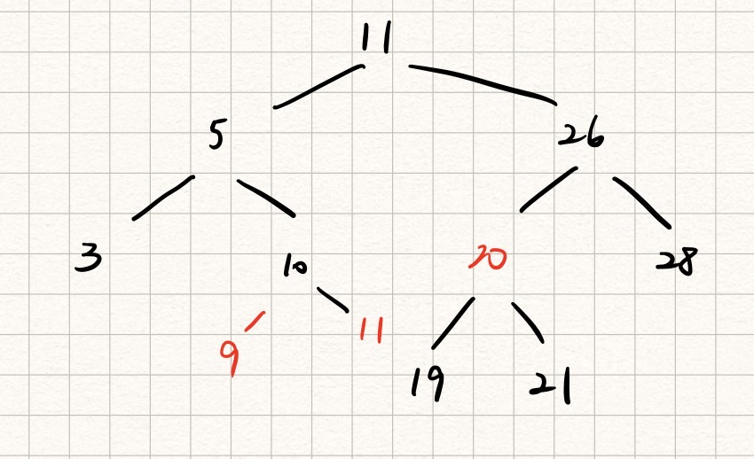
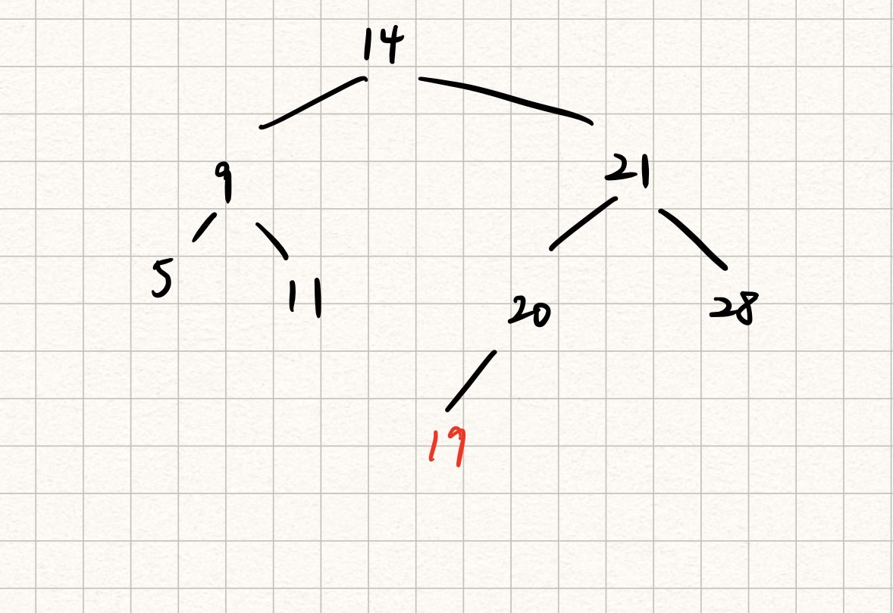
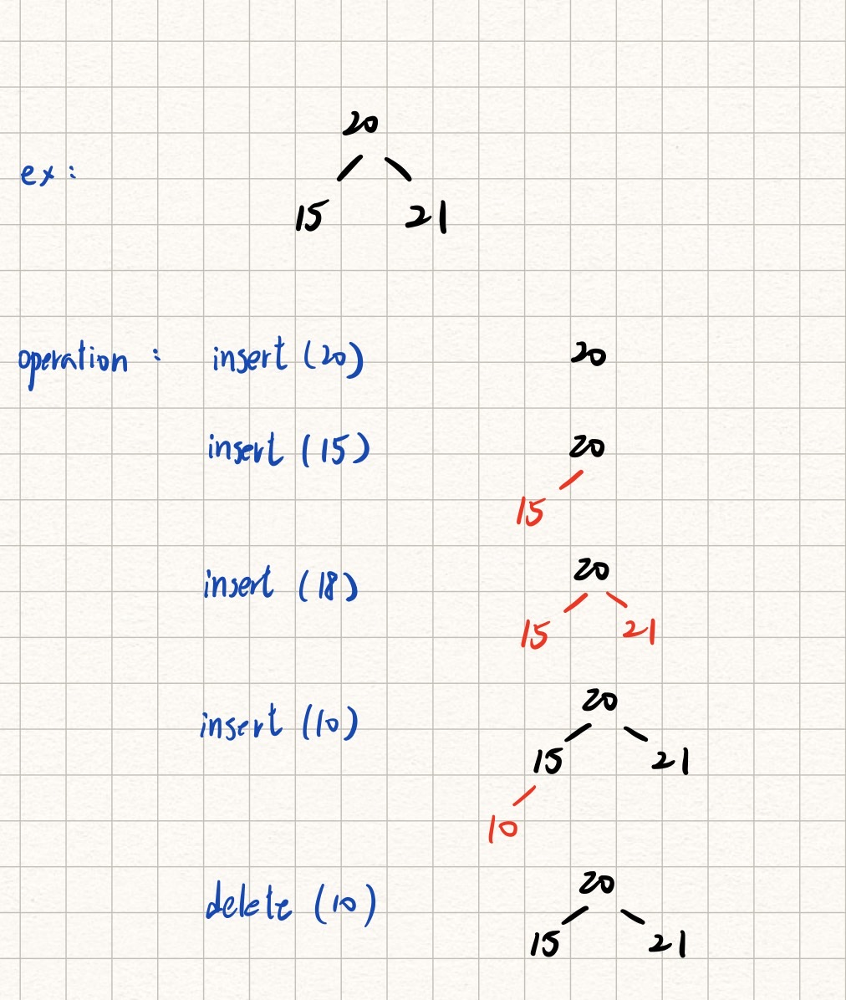

# **DSA-Hw4**

## **Problem 0 - Proper References**
- Problem 1-4: https://www.geeksforgeeks.org/find-the-largest-subarray-with-0-sum/
<br>

## **Problem 1 - Hash Table and Disjoint Set**

### 1.a  

|keys to be inserted \ index |0|1|2|3|4|5|6|
|- |- |- |- |- |- |- |- |
|42|42|- |- |- |- |11|- |
|11|42|- |- |- |- |11|25|
|25|42|- |- |- |- |11|25|
|1 |42|- |- |1 |- |11|25|
|56|42|56|- |1 |- |11|25|
|70|42|56|70|1 |- |11|25|
|19|42|56|70|1 |19|11|25|

### 1.b

|keys to be inserted \ index |0|1|2|3|4|5|6|
|- |- |- |- |- |- |- |- |
|42|42|- |- |- |- |11|- |
|11|42|- |- |- |- |11|- |
|25|42|- |25|- |- |11|- |
|1 |42|- |25|1 |- |11|- |
|56|42|56|25|1 |- |11|- |
|70|42|56|25|1 |- |11|70|
|19|42|56|25|1 |19|11|70|

<br>

### 2.

將房間編號視為二進制的位數， light ON 時為 1， light OFF 時為 0，將light pattern 以17位數的二進位制來表示。 
如範例 light pattern {1, 3, 5, 7, 17}可表示為:
|17|16|15|14|13|12|11|10|9|8|7|6|5|4|3|2|1|
|-|-|-|-|-|-|-|-|-|-|-|-|-|-|-|-|-|
|1|0|0|0|0|0|0|0|0|0|1|0|1|0|1|0|1|

轉換後 index 為 65621。
由於組成 light pattern 的整數代表在二進位表示中該位數為1或-1，因此lighht pattern 中的整數之間沒有排列關係，
且該方法可表示的最大位數為17位，因此可表示的最大值為131071，不會超過上限133333。

<br>

### 3.
HashMap 用來存 {cumSum: index}，(array index 從 1 開始)。  
step1: Insert(0,0)
step2: 從index = 1 開始到 index = arrray length，計算累加到 i-th element 的累加值 cumSum，
若 (cumSum - E) 為 HashMap 中存在的 key，則更新 $maxLen = max(maxLen, (i-Get(cumSum - E)))$，若 cumSum 
不是HashMap 中存在的 key，則 Insert(cumSum, i)


`pseudo code:`

```Python
FindMaxLen(array a):
    HashMap = empty hash map
    HashMap.Insert(0, 0)
    MaxLen = 0
    cumSum = 0
    for i = 1 to a.length:
        cumSum = cumSum + a[i]
        if cumSum not in HashMap:
            Insert(cumSum, i)
        if (cumSum - E) in HashMap:
            MaxLen = max(MaxLen, i - HashMap.Get(cumSum - E)) 
    return MaxLen
```

`time complexity`:  
因 Insert, Get 的 time complexcity 都為 $O(1)$，因此 $FindMaxLen$ 的 
time complexcity 為 $O(n)$
HashMap額外使用的空間最大為 $O(n)$，因此 space complexcity 為 $O(n)$ 

<br>

### 4. 
Ans: $M - N$

<br>

### 5.
由於此題未說明 `insert(value)` 的實做內容，因此假設題目的 insert 函數同課堂講義有實做 heapify 來維持 heap 性質。 MERGE_HEAP(heap a, heap b) 實做將 heap b 的所有 nodes 逐個使用 insert function 加入 heap a，由於假設 insert 有實做 heapify，因此 heap b 所有 node 加入 heap a 後，heap a 仍是維持 heap 的性質。對於 binary tree 中的任何一個 node， insert 進另一個 heap 的次數不會超過樹的高度 $log(N)$，insert 的time complexcity 為 $log(N)$，最糟的狀況下，binary tree 中所有 nodes 都曾 insert 進另一個 heap，time complexcity 為 $O(Nlog^2N)$

`pseudo code:`

```Python
Traverse(heap a, node n):
    if n is not  NIL:
        a->insert(n->val)
        Traverse(a, n->left)
        Traverse(a, n->right)

MERGE_HEAP(heap a, heap b):
   Traverse(a, b)
   return a 
```

<br>

### 6.
假設：  
1 使用講義中的 Tree 法，以 array 儲存每個 element 的 Disjoint-Set 編號。  
2 假設 UNION(x,y) 實做為 $array[x]$ $= y$

step 1:  
以長度為 N 的 陣列 stack_array 儲存 N 個 stacks，每個 $stack_i$ 儲存不能與 $strudent_i$ 分在同一個 group 的學生。  
 
step 2:  
對所有學生執行 MAKE_SET(X_i)，另外執行 MAKE_SET(N+1) 與 MAKE_SET(N+2) 作為 $Group1$ 與 $Group2$。

step 3:  
建立一個 Empty Queue 儲存待處理的 element index of stack_array 。
當前欲處理的 stack index 為 $index = dequeue(Queue)$ -> 亦即當前欲處理的 stack 便為 stack = stack_array[index]。  
由於 stack 儲存的元素 $X$ 代表必須與 index 分在不同 Group 的學生，因此，  
若 `FIND_SET(X) == X` 就將 X 加入與 index 不同的另一個 Group，並將 X 加入 Queue；  
若 `FIND_SET(X) == FIND_SET(index)` 則代表無法將所有 dislike-pair 分成兩群，便可以中斷並且output 分群失敗；  
若 `FIND_SET(X) != FIND_SET(index)` 則代表 X 在前面已經處理過了，可以跳過 X。  

step 4:  
最終如果成功分群，所有 element 都會在 Set_(N+1) 或 Set_(N+2)中，便可依序 output 每個 element 所在的 Group

```Python
Size of mutually_dislike array = [M, 2]
Size of students array = [N]
stacks_array is an empty array whose size is N to store N empty stacks 
Set_array is an empty array whose size is N+2 to store the set index of each element

def partition(mutually_dislike, students):
    # step 1
    for i = 1 to M:
        j = mutually_dislike[i][1]
        k = mutually_dislike[i][2]
        stacks_array[j].push(k)
        stacks_array[k].push(j)
    # step 2
    for i = 1 to N + 2:
        MAKE_SET(i)
    # step 3
    Queue is an empty Queue
    for i = 1 to N:
        if (FIND_SET(i) != i):
            continue
        Queue.enqueue(i)
        while (Queue is not empty):
            index = Queue.dequeue()
            if (FIND_SET(index) == index):
                UNION(index, N+1)

            stack = stacks_array[index]
            Group = FIND_SET(index)
            while (stack is not empty):
                X = stack.pop()
                if (FIND_SET(X) == X):
                    Queue.enqueue(X)
                    targetGroup = Group == N+1 ? N+2 : N+1
                    UNION(X, targetGroup)
                elif (FIND_SET(X) == Group):
                    print("it is not possible to form the two groups as described!")
                    return
                else:
                    continue
    
    # step 4
    for i = 1 to N:
        group_idx = Set_array[i]
        if (group_idx == N+1):
            print(f"student {i} is in Group 1")
        else
            print(f"student {i} is in Group 2")
``` 

<br>


## **Problem 2 - Red-Black Tree**

### 1.
每個 left node 可以與其 parent 做 right rotate，每個 right node 可以與其 parent 做 left rotate，只有 root 沒有 parent 可以做 rotation。一個有 n nodes 的 complete binary tree 有 $\lfloor \frac{(n - 1)}{2} \rfloor$ 個 right node， $\lceil \frac{(n - 1)}{2} \rceil$ 個 left node。


left rotation = $\lfloor \frac{(n - 1)}{2} \rfloor$  
right rotation = $\lceil \frac{(n - 1)}{2} \rceil$

<br>

### 2.
`human alogorithm`:  
從 binary tree 的 root 開始，若目前所在 node 沒有 left node，便將所在 node 指到right node; 若目前所在 node 有 left node，就做 right rotation， 原本的 left child node 在 right rotate 後便會成為該 node 的 parent node，將目前所在的 node 指到該 node 的 parent node，重複上述步驟直到目前所在 node 沒有 left node。當目前所在 node 為 leaf 時終止。
由於在一次 right rotation 後 right-going chain 就會只少增加一個 node，因此最多只會呼叫 n-1 次 right rotate，因此 time complexcity 為 $O(n)$

`pseudo code:`

```Python
Turn-Right-Going-China(Tree T):
    current = T.root
    while (current is not leaf):
        while (current->left is not NIL):
            RIGHT-ROTATE(current)
            current = current->p
        current = current->right
    return T
```

<br>

### 3.
The state is not true.
當一棵 red black tree 只有 black node 時，無論對任何一點做 RIGHT_ROTAE(T,y) or LEFT_ROTATE(T,y) 都不會影響紅黑樹的性質。

<br>

### 4.


<br>

### 5.


<br>

### 6.


因為除了 root node 之外的 insertion 都無法直接插入黑色的 node，否則會破壞到每一個 leaf 經過的 black node 要一樣多的規則，若要使 RB tree 只有 black node，一定要刪除 red node，因此一定的用到 *DELETE* opertation。