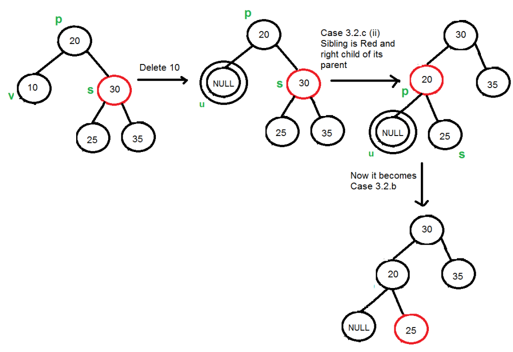

## **Red Black Tree 刪除概念：**
`step1:` 將 RB Tree 當成普通的 Binary Search Tree，將節點刪除  
`step2:` 通過旋轉與重新著色修正回 Red Black Tree，維護 Red Black Tree 的性質  
以 `v` 作為被刪除的節點， `u`作為補上刪除節點位置的節點

### **Red Black Tree 規則**
1. 節點為紅或黑色的
2. root 一定得是黑色的
3. 所有 leaf 都是黑色（leaf 是 NIL 節點)
4. 不會有上下連續兩紅色節點
5. 對每個 node 來說，從它到所有子孫 leaf 的路徑上含有一樣的黑色節點數 or black height

### **Binary Search Tree 刪除場景**
1.  `刪除的節點為 leaf :` 直接刪除
2.  `刪除的節點只有左子樹或右子樹：` 將子樹上移到刪除的節點位置
3.  `刪除的節點有左子樹也有右子樹：` 找到左子樹中最大的節點或右子樹中最小的節點作為替代節點，複製值到原本欲刪除的節點位置，刪除替代節點

> 以上三種刪除狀況可以視為刪除只有一個 child 的節點(因為 RB Tree 的 leaf 是黑色 NIL 節點，若刪除的節點的左右節點都是 leaf(NIL)，只會有一個 NIL 補上來)

 

## **簡單刪除狀況**
### **u or v 其中一者為紅**

- v 紅 u 黑： u直接補上去
- v 黑 u 紅： u補上去後改為黑色

### **u and v 都為黑，且 v 為 root**
u直接補上去，因為 root 不會有祖先因此少算一份黑色節點

 

## **複雜刪除狀況(u and v 皆為黑且 v 不為 root)**
以下關係都是以 u 補上 v 位置後為基準，並且以 u 為父節點 p 的 left child 舉例，若 u 為父節點 p 的 right child，將下述過程盡向左右顛倒就可以

### **`情況一： u 的兄弟 s 是黑色的，且 s 的右邊小孩 r 為紅色的`**

> 現在左子樹比右子樹少一個黑色

1. 將 r 變成 s 的顏色
2. 將 s 變成 p 的顏色
3. 將 p 變成黑色
4. Left Rotation(p)

### **`情況二： u 的兄弟 s 是黑色的，且 s 的左邊小孩 r 為紅色的`**

1. 將 s 變成紅色
2. 將 r 變成黑色
3. Right Rotation(s)
4. 變成情況一

or  

1. 將 r 變成 p 的顏色
2. 將 p 變成黑色
3. Right Rotation(s)
4. Left Rotation(p)

(其實是做一樣的事情)

### **`情況三： u 的兄弟 s 是黑色的，且 s 的兩個小孩都是黑色的`**

遞迴處理直到 double black 節點的 parent 為紅色為止。

1. 將 s 變成紅色
2. 若 p 為紅色，將 p 變成黑色，若 p 為黑色則令 p 為 new u 繼續遞迴處理

###  **`情況四： u 的兄弟 s 是紅色的`**

1. 將 s 變成黑色
2. 將 p 變成紅色
3. Left Rotation(p)
4. 變成情況三

## **Reference**
https://zhuanlan.zhihu.com/p/145006031  
https://www.geeksforgeeks.org/red-black-tree-set-3-delete-2/?ref=lbp